# petclinic-uml

Object Oriented Software Engineering: OOA and OOD of the Spring Petclinc using UML. 

## What is it?

These Demo Application are planned to be a "Rosetta Stone" for compare OOP Web Application Frameworks like 

* [Jakarta EE (Java)](https://jakarta-ee-petclinic.github.io/petclinic-jakartaee/)
* [Java EE 7](https://jakarta-ee-petclinic.github.io/petclinic-javaee7/)
* [Java EE 6](https://jakarta-ee-petclinic.github.io/petclinic-jee6/)
* [Symfony (PHP)](https://jakarta-ee-petclinic.github.io/petclinic_symfony/)
* [Django (Python)](https://jakarta-ee-petclinic.github.io/petclinic_django/)
* [Flask with SQLalchemy (Python)](https://jakarta-ee-petclinic.github.io/petclinic_flask/)
* Fluid,Extbase (TYPO3-CMS, PHP)

This OOA and OOD should extract and divide the functional Requirements from the nonfunctional Requirements 
of the Frameworks.

* Most of the Frameworks compared here use Model-2 MVC Pattern for the Web/Presentation-Tier 
but Jakarta EE uses JSF (Java Server Faces), a Component Based Web/Presentation-Tier. 

This Specification should also serve as Specification for non-Web Frontends like:
* [Qt (C++)](https://jakarta-ee-petclinic.github.io/petclinic-qt5/)
* [Qt (Python)](https://jakarta-ee-petclinic.github.io/petclinic-pyqt/)
* [Java Swing](https://jakarta-ee-petclinic.github.io/petclinic-java-swing/)

## Why Petclinic? 

* The Domain Classes show all relationships like one-to-many (1:n), many-to-one (n:1) and many-to-many (n:m)
* It is simple enough but yet it shows more than just the CRUD Use Cases (Create, Read, Update, Delete) of most Demos and Training Examples. 
* You can think of it as smallest complete Web App with the usual things to solve. 

## Functional Requirements 

Object Oriented Design

## Petclinic Overview

### Petclinic Domain Class Modell
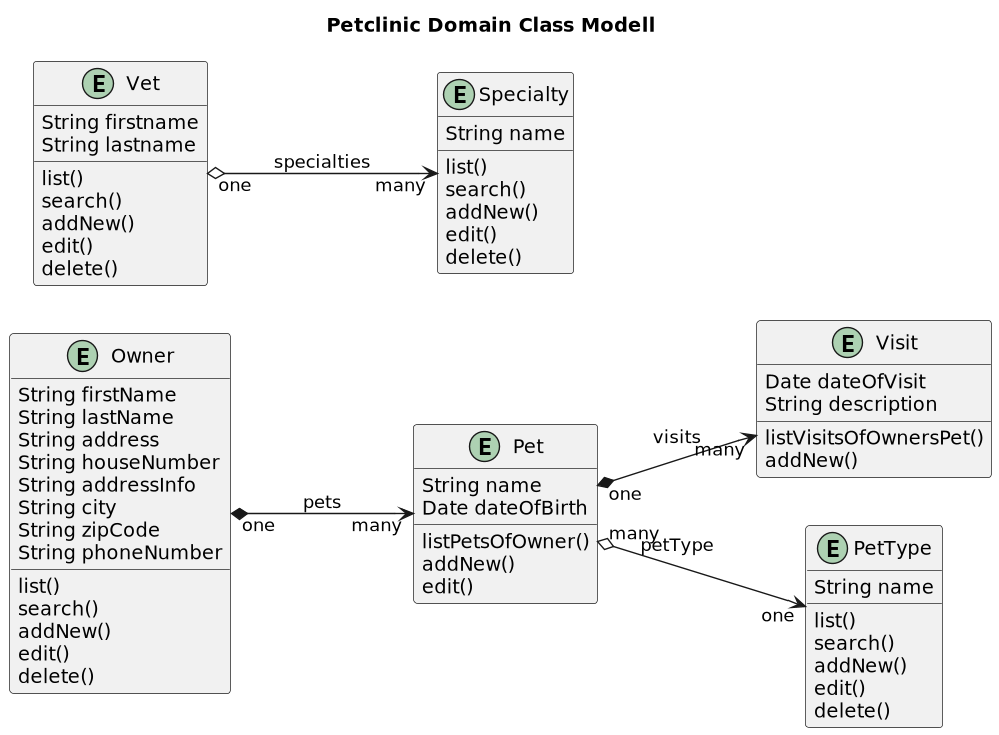

### Petclinic Use Case Diagram

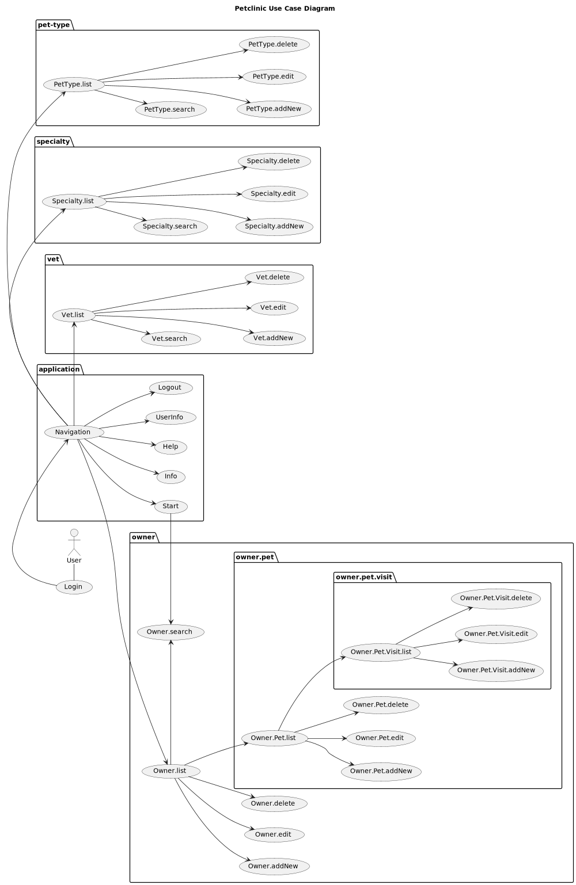

## Application

## Vet and Specialty

### Specialty

#### Specialty Use Case Diagram

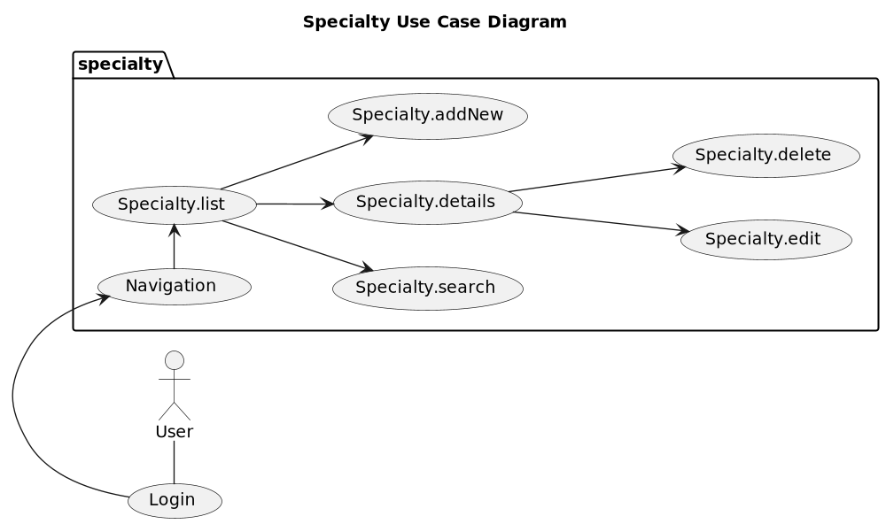

#### Specialty Use Case and State Table

| Specialty Use Cases  | Specialty States             | Frontend                                |
|----------------------|------------------------------|-----------------------------------------|
| Specialty.list       | SPECIALTY_LIST_EMPTY         | Disable Search-Button and Paging-Widget |
| Specialty.list       | SPECIALTY_LIST               |                                         |
| Specialty.search *   | SPECIALTY_LIST_SEARCH_RESULT |                                         |
| Specialty.addNew     | SPECIALTY_NEW                |                                         |
| Specialty.details    | SPECIALTY_DETAILS            |                                         |
| Specialty.edit       | SPECIALTY_EDIT               |                                         |
| Specialty.delete     | SPECIALTY_DELETE             |                                         | 

*) TODO

#### Specialty State Diagram

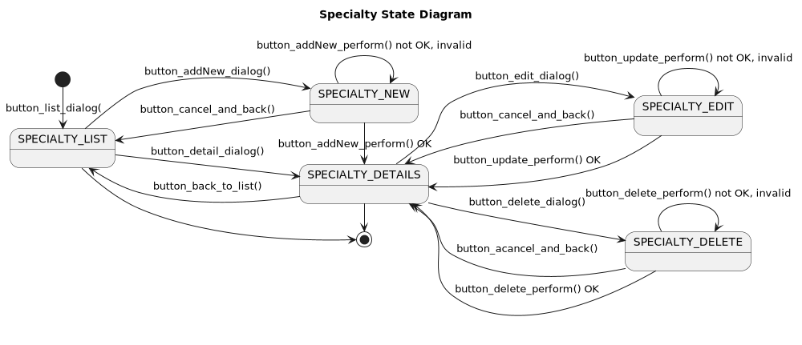

#### Specialty State Table

| PetType Use Cases   | Actions                                   | Frontend to View                         | View to Backend (DB) | outcome             | precondition                        | postcondition                                  |
|---------------------|-------------------------------------------|------------------------------------------|--------------------|---------------------|-------------------------------------|------------------------------------------------|
| Specialty.list      | SpecialtyView.button_list_dialog()        | x, calls: SpecialtyView.load_list()      |                    | change state        | length(list(Specialty)) == 0        | SPECIALTY_LIST_EMPTY                           |
| Specialty.list      | SpecialtyView.button_list_dialog()        | x, calls: SpecialtyView.load_list()      |                    | change state        | length(list(Specialty)) > 0         | SPECIALTY_LIST                                 |
| Specialty.list      | SpecialtyView.load_list()                 |                                          | x                  | list(Specialty)     | length(list(Specialty)) == 0        | SPECIALTY_LIST_EMPTY                           |
| Specialty.list      | SpecialtyView.load_list()                 |                                          | x                  | list(Specialty)     | length(list(Specialty)) > 0         | SPECIALTY_LIST                                 |
| Specialty.addNew    | SpecialtyView.button_addNew_dialog()      | x                                        |                    | change state        | SPECIALTY_LIST                      | SPECIALTY_NEW                                  |
| Specialty.addNew    | SpecialtyView.button_cancel_and_back()    | x                                        |                    | change state        | SPECIALTY_NEW                       | SPECIALTY_LIST                                 |
| Specialty.addNew    | SpecialtyView.button_addNew_perform()     | x, calls: SpecialtyView.db_addNew()      |                    | if OK: change state | SPECIALTY_NEW                       | SPECIALTY_DETAILS                              |
| Specialty.addNew    | SpecialtyView.db_addNew()                 |                                          | x                  | OK                  | length(list(Specialty)) = n         | length(list(Specialty)) = n+1                  |
| Specialty.addNew    | SpecialtyView.db_addNew()                 |                                          | x                  | not OK, invalid     | length(list(Specialty)) = n         | display cause as flash message                 |
| Specialty.details   | SpecialtyView.button_detail_dialog()      | x                                        |                    | change state        | SPECIALTY_LIST                      | SPECIALTY_DETAILS                              |
| Specialty.details   | SpecialtyView.button_detail_dialog()      | x                                        |                    | change state        | SPECIALTY_LIST_EMPTY                | SPECIALTY_DETAILS                              |
| Specialty.edit      | SpecialtyView.button_edit_dialog()        | x                                        |                    | change state        | SPECIALTY_DETAILS                   | SPECIALTY_EDIT                                 |
| Specialty.edit      | SpecialtyView.button_cancel_and_back()    | x                                        |                    | change state        | SPECIALTY_EDIT                      | SPECIALTY_LIST                                 |
| Specialty.edit      | SpecialtyView.button_update_perform()     | x, calls: SpecialtyView.db_update()      |                    | if OK: change state | SPECIALTY_EDIT                      | SPECIALTY_DETAILS                              |
| Specialty.edit      | SpecialtyView.db_update()                 |                                          | x                  | OK                  | length(list(Specialty)) = n > 0     | length(list(Specialty)) = n; 1 element changed |
| Specialty.edit      | SpecialtyView.db_update()                 |                                          | x                  | not OK, invalid     | length(list(Specialty)) = n >= 0    | display cause as flash message                 |
| Specialty.delete    | SpecialtyView.button_delete_dialog()      | x                                        |                    | change state        | SPECIALTY_DETAILS                   | SPECIALTY_DELETE                               |
| Specialty.delete    | SpecialtyView.button_cancel_and_back()    | x                                        |                    | change state        | SPECIALTY_DELETE                    | SPECIALTY_LIST                                 |
| Specialty.delete    | SpecialtyView.button_delete_perform()     | x, calls: SpecialtyView.db_delete()      |                    | if OK: change state | SPECIALTY_DELETE                    | SPECIALTY_DETAILS                              |
| Specialty.delete    | SpecialtyView.db_delete()                 |                                          | x                  | OK                  | length(list(Specialty)) = n > 0     | length(list(Specialty)) = n-1                  |
| Specialty.delete    | SpecialtyView.db_delete()                 |                                          | x                  | not OK, invalid     | length(list(Specialty)) = n >= 0    | display cause as flash message                 |

### Vet

#### Vet Use Case Diagram

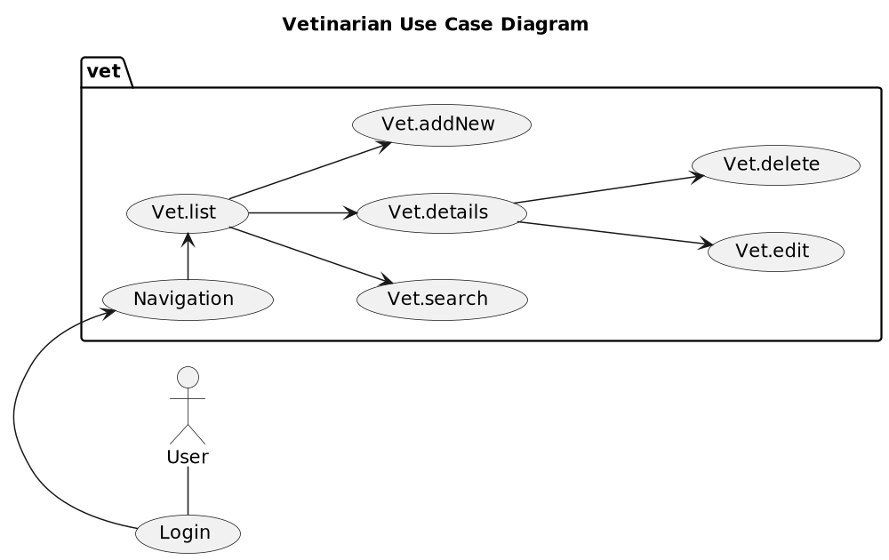

#### Vet Use Case and State Table

| Use Case     | Vetinarian States       | Frontend                                |
|--------------|-------------------------|-----------------------------------------|
| Vet.list     | VET_LIST_EMPTY          | Disable Search-Button and Paging-Widget |
| Vet.list     | VET_LIST                |                                         |
| Vet.search * | VET_LIST_SEARCH_RESULT  |                                         |
| Vet.addNew   | VET_NEW                 |                                         |
| Vet.details  | vet_DETAILS             |                                         |
| Vet.details  | VET_DETAILS             |                                         |
| Vet.edit     | VET_EDIT                |                                         |
| Vet.delete   | VET_DELETE              |                                         |   

*) TODO

#### Vet State Diagram

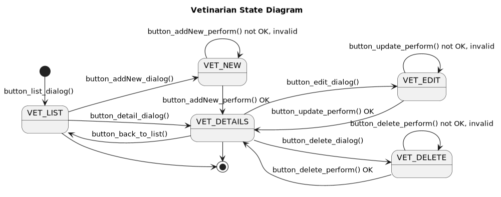

#### Vet State Table

| PetType Use Cases | Actions                             | Frontend to View                   | View to Backend (DB) | outcome             | precondition                  | postcondition                            |
|-------------------|-------------------------------------|------------------------------------|----------------------|---------------------|-------------------------------|------------------------------------------|
| Vet.list          | VetView.button_list_dialog()        | x, calls: VetView.load_list()      |                      | change state        | length(list(Vet)) == 0        | VET_LIST_EMPTY                           |
| Vet.list          | VetView.button_list_dialog()        | x, calls: VetView.load_list()      |                      | change state        | length(list(Vet)) > 0         | VET_LIST                                 |
| Vet.list          | VetView.load_list()                 |                                    | x                    | list(Vet)           | length(list(Vet)) == 0        | VET_LIST_EMPTY                           |
| Vet.list          | VetView.load_list()                 |                                    | x                    | list(Vet)           | length(list(Vet)) > 0         | VET_LIST                                 |
| Vet.addNew        | VetView.button_addNew_dialog()      | x                                  |                      | change state        | VET_LIST                      | VET_NEW                                  |
| Vet.addNew        | VetView.button_cancel_and_back()    | x                                  |                      | change state        | VET_NEW                       | VET_LIST                                 |
| Vet.addNew        | VetView.button_addNew_perform()     | x, calls: VetView.db_addNew()      |                      | if OK: change state | VET_NEW                       | VET_DETAILS                              |
| Vet.addNew        | VetView.db_addNew()                 |                                    | x                    | OK                  | length(list(Vet)) = n         | length(list(Vet)) = n+1                  |
| Vet.addNew        | VetView.db_addNew()                 |                                    | x                    | not OK, invalid     | length(list(Vet)) = n         | display cause as flash message           |
| Vet.details       | VetView.button_detail_dialog()      | x                                  |                      | change state        | VET_LIST                      | VET_DETAILS                              |
| Vet.details       | VetView.button_detail_dialog()      | x                                  |                      | change state        | VET_LIST_EMPTY                | VET_DETAILS                              |
| Vet.edit          | VetView.button_edit_dialog()        | x                                  |                      | change state        | VET_DETAILS                   | VET_EDIT                                 |
| Vet.edit          | VetView.button_cancel_and_back()    | x                                  |                      | change state        | VET_EDIT                      | VET_LIST                                 |
| Vet.edit          | VetView.button_update_perform()     | x, calls: VetView.db_update()      |                      | if OK: change state | VET_EDIT                      | VET_DETAILS                              |
| Vet.edit          | VetView.db_update()                 |                                    | x                    | OK                  | length(list(Vet)) = n > 0     | length(list(Vet)) = n; 1 element changed |
| Vet.edit          | VetView.db_update()                 |                                    | x                    | not OK, invalid     | length(list(Vet)) = n >= 0    | display cause as flash message           |
| Vet.delete        | VetView.button_delete_dialog()      | x                                  |                      | change state        | VET_DETAILS                   | VET_DELETE                               |
| Vet.delete        | VetView.button_cancel_and_back()    | x                                  |                      | change state        | VET_DELETE                    | VET_LIST                                 |
| Vet.delete        | VetView.button_delete_perform()     | x, calls: VetView.db_delete()      |                      | if OK: change state | VET_DELETE                    | VET_DETAILS                              |
| Vet.delete        | VetView.db_delete()                 |                                    | x                    | OK                  | length(list(Vet)) = n > 0     | length(list(Vet)) = n-1                  |
| Vet.delete        | VetView.db_delete()                 |                                    | x                    | not OK, invalid     | length(list(Vet)) = n >= 0    | display cause as flash message           |

### VetView and SpecialtyView Class Diagram

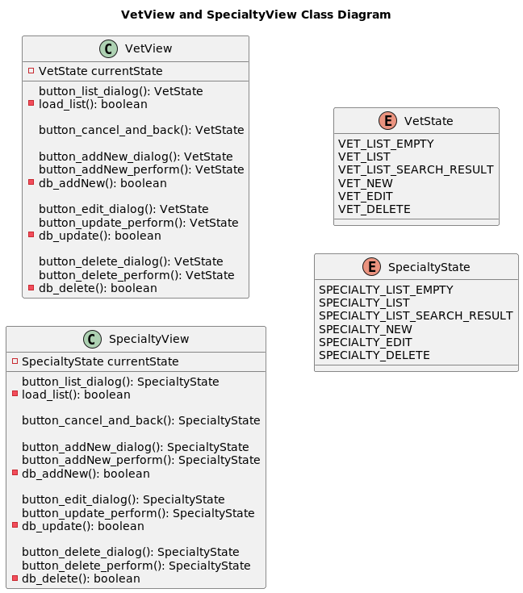

### Specialty and Vet DB Backend: vet.oodm

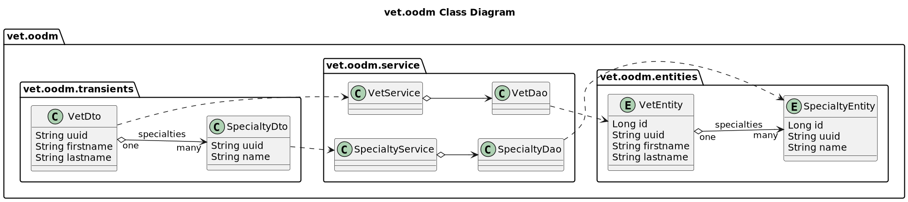

## Owner and PetType

### PetType 

#### PetType Use Case Diagram

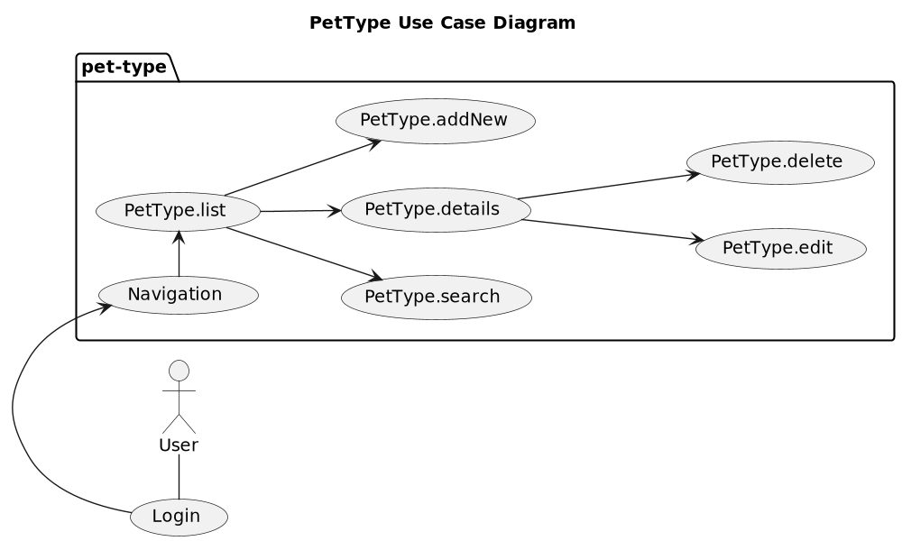

#### PetType Use Cases and States Table

| PetType States   | PetType Use Cases          | Frontend                                 |
|------------------|----------------------------|------------------------------------------|
| PetType.list     | PETTYPE_LIST_EMPTY         | Disable Search-Button and Paging-Widget  |
| PetType.list     | PETTYPE_LIST               |                                          |
| PetType.search * | PETTYPE_LIST_SEARCH_RESULT |                                          |
| PetType.addNew   | PETTYPE_NEW                |                                          |
| PetType.details  | PETTYPE_DETAILS            |                                          |
| PetType.edit     | PETTYPE_EDIT               |                                          |
| PetType.delete   | PETTYPE_DELETE             |                                          |

*) TODO
#### PetType State Diagram

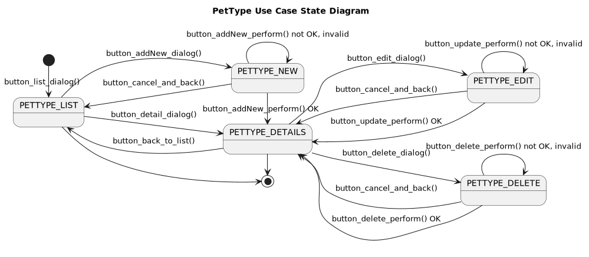

#### PetType State Table

| PetType Use Cases | Actions                              | Frontend to View              | View to Backend (DB) | outcome             | precondition                   | postcondition                                |
|-------------------|--------------------------------------|-------------------------------|----------------------|---------------------|--------------------------------|----------------------------------------------|
| PetType.list      | PetTypeView.button_list_dialog()     | x, calls: PetType.load_list() |                      | change state        | length(list(PetType)) == 0     | PETTYPE_LIST_EMPTY                           |
| PetType.list      | PetTypeView.button_list_dialog()     | x, calls: PetType.load_list() |                      | change state        | length(list(PetType)) > 0      | PETTYPE_LIST                                 |
| PetType.list      | PetTypeView.load_list()              |                               | x                    | list(PetType)       | length(list(PetType)) == 0     | PETTYPE_LIST_EMPTY                           |
| PetType.list      | PetTypeView.load_list()              |                               | x                    | list(PetType)       | length(list(PetType)) > 0      | PETTYPE_LIST                                 |
| PetType.addNew    | PetTypeView.button_addNew_dialog()   | x                             |                      | change state        | PETTYPE_LIST                   | PETTYPE_NEW                                  |
| PetType.addNew    | PetTypeView.button_cancel_and_back() | x                             |                      | change state        | PETTYPE_NEW                    | PETTYPE_LIST                                 |
| PetType.addNew    | PetTypeView.button_addNew_perform()  | x, calls: PetType.db_addNew() |                      | if OK: change state | PETTYPE_NEW                    | PETTYPE_DETAILS                              |
| PetType.addNew    | PetTypeView.db_addNew()              |                               | x                    | OK                  | length(list(PetType)) = n      | length(list(PetType)) = n+1                  |
| PetType.addNew    | PetTypeView.db_addNew()              |                               | x                    | not OK, invalid     | length(list(PetType)) = n      | display cause as flash message               |
| PetType.details   | PetTypeView.button_detail_dialog()   | x                             |                      | change state        | PETTYPE_LIST                   | PETTYPE_DETAILS                              |
| PetType.details   | PetTypeView.button_detail_dialog()   | x                             |                      | change state        | PETTYPE_LIST_EMPTY             | PETTYPE_DETAILS                              |
| PetType.edit      | PetTypeView.button_edit_dialog()     | x                             |                      | change state        | PETTYPE_DETAILS                | PETTYPE_EDIT                                 |
| PetType.edit      | PetTypeView.button_cancel_and_back() | x                             |                      | change state        | PETTYPE_EDIT                   | PETTYPE_LIST                                 |
| PetType.edit      | PetTypeView.button_update_perform()  | x, calls: PetType.db_update() |                      | if OK: change state | PETTYPE_EDIT                   | PETTYPE_DETAILS                              |
| PetType.edit      | PetTypeView.db_update()              |                               | x                    | OK                  | length(list(PetType)) = n > 0  | length(list(PetType)) = n; 1 element changed |
| PetType.edit      | PetTypeView.db_update()              |                               | x                    | not OK, invalid     | length(list(PetType)) = n >= 0 | display cause as flash message               |
| PetType.delete    | PetTypeView.button_delete_dialog()   | x                             |                      | change state        | PETTYPE_DETAILS                | PETTYPE_DELETE                               |
| PetType.delete    | PetTypeView.button_cancel_and_back() | x                             |                      | change state        | PETTYPE_DELETE                 | PETTYPE_LIST                                 |
| PetType.delete    | PetTypeView.button_delete_perform()  | x, calls: PetType.db_delete() |                      | if OK: change state | PETTYPE_DELETE                 | PETTYPE_DETAILS                              |
| PetType.delete    | PetTypeView.db_delete()              |                               | x                    | OK                  | length(list(PetType)) = n > 0  | length(list(PetType)) = n-1                  |
| PetType.delete    | PetTypeView.db_delete()              |                               | x                    | not OK, invalid     | length(list(PetType)) = n >= 0 | display cause as flash message               |

### Owner

#### Owner Use Cases

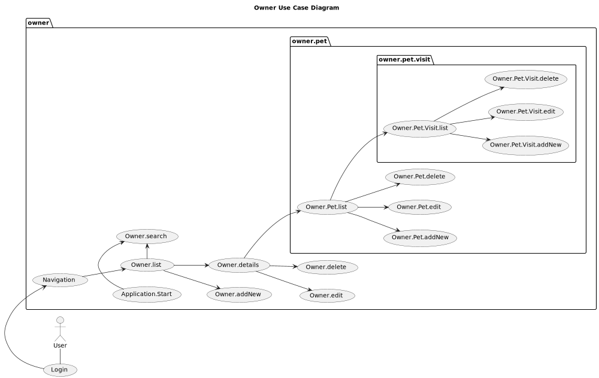

#### Owner State

| Use Case               | Owner States             | Frontend                                                |
|------------------------|--------------------------|---------------------------------------------------------|
| Owner.list *           | OWNER_LIST_EMPTY         | Disable Edit-, Delete-, Search-Button and Paging-Widget |
| Owner.list *           | OWNER_LIST               |                                                         |
| Owner.list *           | OWNER_LIST_SEARCH_RESULT |                                                         |
| Owner.addNew           | OWNER_NEW                |                                                         | 
| Owner.details          | OWNER_DETAILS            |                                                         |   
| Owner.edit             | OWNER_EDIT               |                                                         |  
| Owner.delete           | OWNER_DELETE             |                                                         |   
| Owner.Pet.addNew       | OWNER_PET_NEW            |                                                         |
| Owner.Pet.edit         | OWNER_PET_EDIT           |                                                         |    
| Owner.Pet.delete       | OWNER_PET_DELETE         |                                                         | 
| Owner.Pet.Visit.addNew | OWNER_PET_VISIT_NEW      |                                                         |
| Owner.Pet.Visit.edit   | OWNER_PET_VISIT_EDIT     |                                                         |
| Owner.Pet.Visit.delete | OWNER_PET_VISIT_DELETE   |                                                         |

*) TODO

#### Owner State Diagram

##### Owner State Diagram

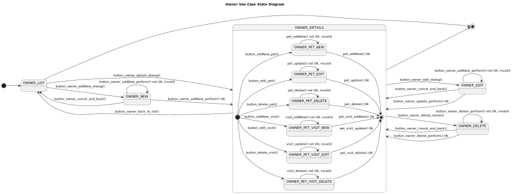

##### Owner State Diagram without Pet and Visits
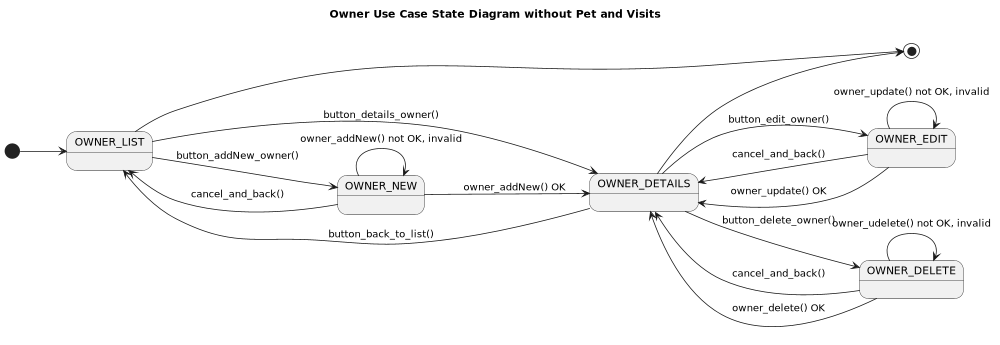

##### Owner State Diagram of Pet and Visits
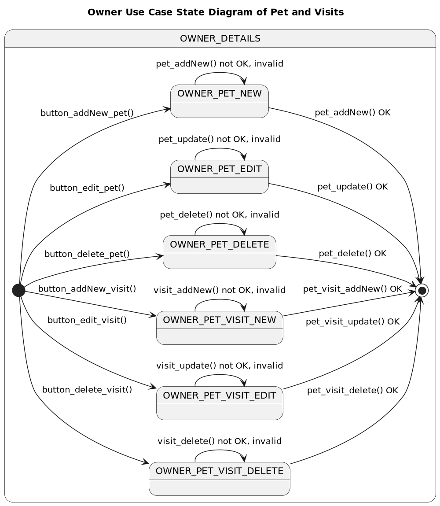

#### Owner State Table

| Use Case               | Actions                                  | Frontend to View                  | View to Backend (DB) | outcome             | precondition                     | postcondition                              |
|------------------------|------------------------------------------|-----------------------------------|----------------------|---------------------|----------------------------------|--------------------------------------------|
| Owner.list             | OwnerView.button_list_dialog()           | x, calls: VetView.load_list()     |                      | change state        | length(list(Owner)) == 0         | OWNER_LIST_EMPTY                           |
| Owner.list             | OwnerView.button_list_dialog()           | x, calls: VetView.load_list()     |                      | change state        | length(list(Owner)) > 0          | OWNER_LIST                                 |
| Owner.list             | OwnerView.load_list()                    |                                   | x                    | list(Owner)         | length(list(Owner)) == 0         | OWNER_LIST_EMPTY                           |
| Owner.list             | OwnerView.load_list()                    |                                   | x                    | list(Owner)         | length(list(Owner)) > 0          | OWNER_LIST                                 |
| Owner.addNew           | OwnerView.button_owner_addNew_dialog()   | x                                 |                      | change state        | OWNER_LIST                       | OWNER_NEW                                  |
| Owner.addNew           | OwnerView.button_owner_cancel_and_back() | x                                 |                      | change state        | OWNER_NEW                        | OWNER_LIST                                 |
| Owner.addNew           | OwnerView.button_owner_addNew_perform()  | x, calls: Owner.db_owner_addNew() |                      | if OK: change state | OWNER_NEW                        | OWNER_LIST                                 |
| Owner.addNew           | OwnerView.db_owner_addNew()              |                                   | x                    | OK                  | length(list(Owner)) = n          | length(list(Owner)) = n+1                  |
| Owner.addNew           | OwnerView.db_owner_addNew()              |                                   | x                    | not OK, invalid     | length(list(Owner)) = n          | display cause as flash message             |
| Owner.details          | OwnerView.button_owner_details_dialog()  | x                                 |                      | change state        | OWNER_LIST                       | OWNER_DETAILS                              |
| Owner.details          | OwnerView.button_owner_back_to_list()    | x                                 |                      | change state        | OWNER_DETAILS                    | OWNER_LIST                                 |
| Owner.edit             | OwnerView.button_owner_edit_dialog()     | x                                 |                      | change state        | OWNER_DETAILS                    | OWNER_EDIT                                 |
| Owner.edit             | OwnerView.button_owner_cancel_and_back() | x                                 |                      | change state        | OWNER_EDIT                       | OWNER_DETAILS                              |
| Owner.edit             | OwnerView.button_owner_update_perform()  | x, calls: Owner.db_owner_update() |                      | if OK: change state | OWNER_EDIT                       | OWNER_DETAILS                              |
| Owner.edit             | OwnerView.db_owner_update()              |                                   | x                    | OK                  | length(list(Owner)) = n > 0      | length(list(Owner)) = n; 1 element changed |
| Owner.edit             | OwnerView.db_owner_update()              |                                   | x                    | not OK, invalid     | length(list(Owner)) = n >= 0     | display cause as flash message             |
| Owner.delete           | OwnerView.button_owner_delete_dialog()   | x                                 |                      | change state        | OWNER_DETAILS                    | OWNER_DELETE                               |
| Owner.delete           | OwnerView.button_owner_cancel_and_back() | x                                 |                      | change state        | OWNER_DELETE                     | OWNER_DETAILS                              |
| Owner.delete           | OwnerView.button_owner_delete_perform()  | x, calls: Owner.db_owner_delete() |                      | if OK: change state | OWNER_DELETE                     | OWNER_DETAILS                              |
| Owner.delete           | OwnerView.db_owner_delete()              |                                   | x                    | OK                  | length(list(Owner)) = n > 0      | length(list(Owner)) = n-1                  |
| Owner.delete           | OwnerView.db_owner_delete()              |                                   | x                    | not OK, invalid     | length(list(Owner)) = n >= 0     | display cause as flash message             |
| Owner.Pet.addNew       | OwnerView.button_pet_addNew_dialog()     | x                                 |                      | change state        | OWNER_DETAILS                    | OWNER_PET_NEW                              |
| Owner.Pet.addNew       | OwnerView.button_pet_addNew_perform()    | x, calls: Owner.db_pet_addNew()   |                      | change state        | OWNER_PET_NEW                    | OWNER_DETAILS                              |
| Owner.Pet.addNew       | OwnerView.db_pet_addNew()                |                                   | x                    | OK                  | length(list(Pet)) = n            | length(list(Pet)) = n+1                    |
| Owner.Pet.addNew       | OwnerView.db_pet_addNew()                |                                   | x                    | not OK, invalid     | length(list(Pet)) = n            | display cause as flash message             |
| Owner.Pet.edit         | OwnerView.button_pet_edit_dialog()       | x                                 |                      | change state        | OWNER_DETAILS                    | OWNER_PET_EDIT                             |
| Owner.Pet.edit         | OwnerView.button_pet_update_perform()    | x, calls: Owner.db_pet_update()   |                      | change state        | OWNER_PET_EDIT                   | OWNER_DETAILS                              |
| Owner.Pet.edit         | OwnerView.db_pet_update()                |                                   | x                    | OK                  | length(list(Pet)) = n            | length(list(Pet)) = n; 1 element changed   |
| Owner.Pet.edit         | OwnerView.db_pet_update()                |                                   | x                    | not OK, invalid     | length(list(Pet)) = n            | display cause as flash message             |
| Owner.Pet.delete       | OwnerView.button_pet_delete_dialog()     | x                                 |                      | change state        | OWNER_DETAILS                    | OWNER_PET_DELETE                           |
| Owner.Pet.delete       | OwnerView.button_pet_delete_perform()    | x, calls: Owner.db_pet_delete()   |                      | change state        | OWNER_PET_DELETE                 | OWNER_DETAILS                              |
| Owner.Pet.delete       | OwnerView.db_pet_delete()                |                                   | x                    | OK                  | length(list(Pet)) = n > 0        | length(list(Pet)) = n-1                    |
| Owner.Pet.delete       | OwnerView.db_pet_delete()                |                                   | x                    | not OK, invalid     | length(list(Pet)) = n >= 0       | display cause as flash message             |
| Owner.Pet.Visit.addNew | OwnerView.button_visit_addNew_dialog()   | x                                 |                      | change state        | OWNER_DETAILS                    | OWNER_PET_VISIT_NEW                        |
| Owner.Pet.Visit.addNew | OwnerView.button_visit_addNew_perform()  | x, calls: Owner.db_visit_addNew() |                      | change state        | OWNER_PET_VISIT_NEW              | OWNER_DETAILS                              |
| Owner.Pet.Visit.addNew | OwnerView.db_visit_addNew()              |                                   | x                    | OK                  | length(list(Visit)) = n          | length(list(Visit)) = n+1                  |
| Owner.Pet.Visit.addNew | OwnerView.db_visit_addNew()              |                                   | x                    | not OK, invalid     | length(list(Visit)) = n          | display cause as flash message             |
| Owner.Pet.Visit.edit   | OwnerView.button_visit_edit_dialog()     | x                                 |                      | change state        | OWNER_DETAILS                    | OWNER_PET_VISIT_EDIT                       |
| Owner.Pet.Visit.edit   | OwnerView.button_visit_update_perform()  | x, calls: Owner.db_visit_update() |                      | change state        | OWNER_PET_VISIT_EDIT             | OWNER_DETAILS                              |
| Owner.Pet.Visit.edit   | OwnerView.db_visit_update()              |                                   | x                    | OK                  | length(list(Visit)) = n          | length(list(Visit)) = n; 1 element changed |
| Owner.Pet.Visit.edit   | OwnerView.db_visit_update()              |                                   | x                    | not OK, invalid     | length(list(Visit)) = n          | display cause as flash message             |
| Owner.Pet.Visit.delete | OwnerView.button_visit_delete_dialog()   | x                                 |                      | change state        | OWNER_DETAILS                    | OWNER_PET_VISIT_DELETE                     |
| Owner.Pet.Visit.delete | OwnerView.button_visit_delete_perform()  | x, calls: Owner.db_visit_delete() |                      | change state        | OWNER_PET_VISIT_DELETE           | OWNER_DETAILS                              |
| Owner.Pet.Visit.delete | OwnerView.db_visit_delete()              |                                   | x                    | OK                  | length(list(Visit)) = n > 0      | length(list(Visit)) = n-1                  |
| Owner.Pet.Visit.delete | OwnerView.db_visit_delete()              |                                   | x                    | not OK, invalid     | length(list(Visit)) = n >= 0     | display cause as flash message             |

### OwnerView and PetTypeView Class Diagram

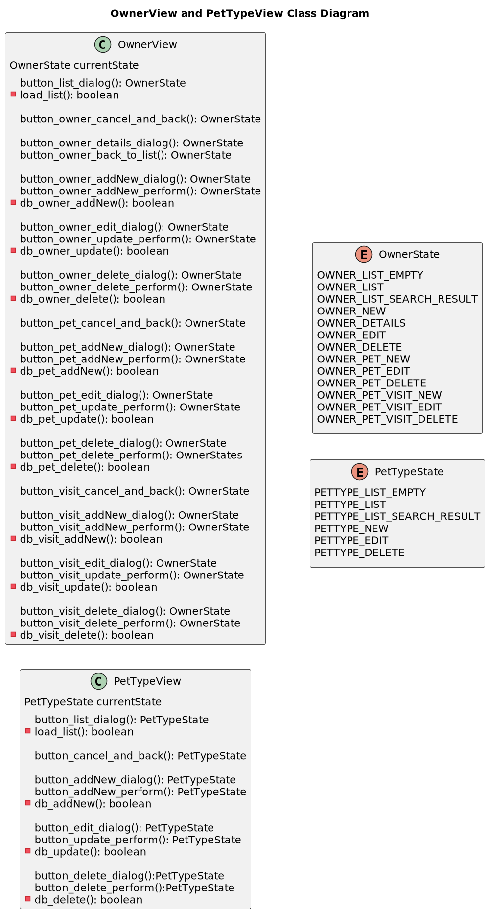

### Owner and PetType DB Backend: owner.oodm

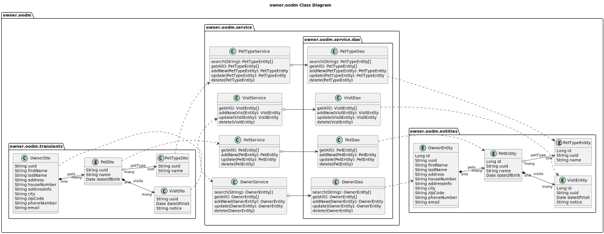

## Imprint
* [(c) 2022 Thomas Woehlke](https://github.com/thomaswoehlke)
* [This Document](https://jakarta-ee-petclinic.github.io/petclinic-uml/)
* [github repository](https://github.com/Jakarta-EE-Petclinic/petclinic-uml)