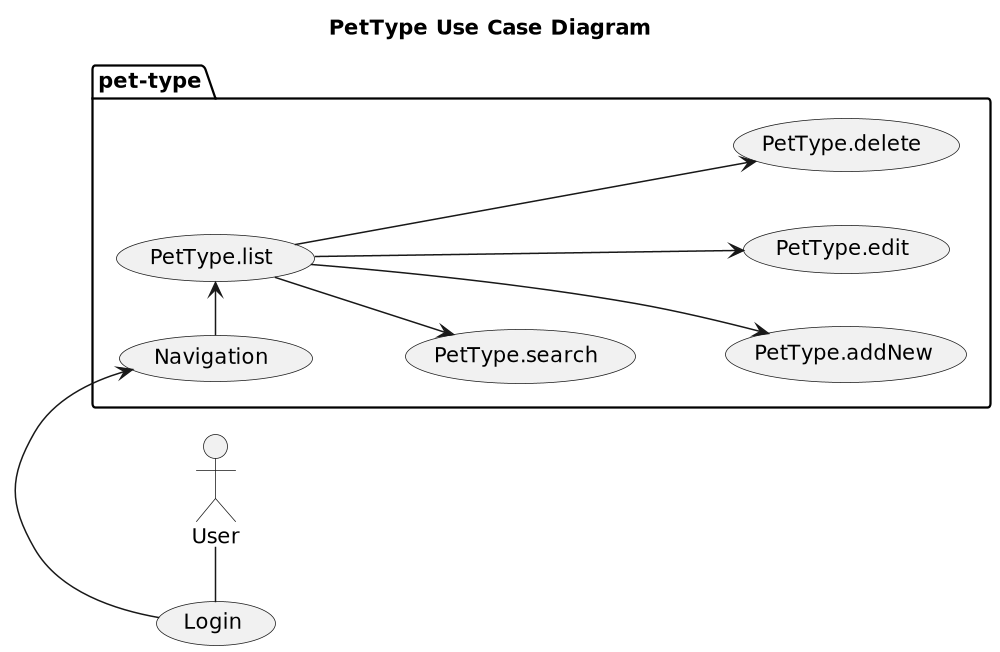
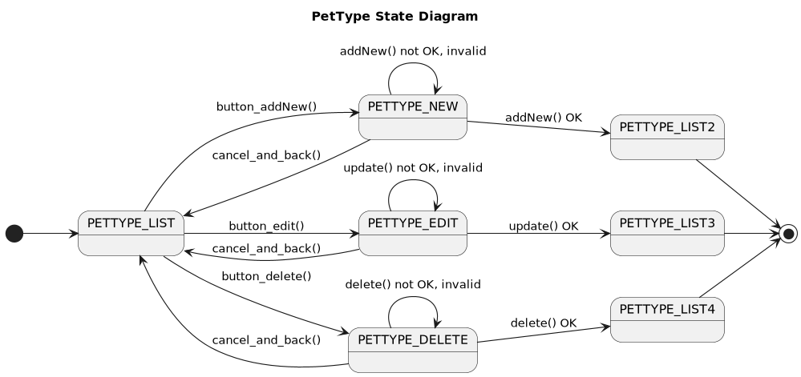
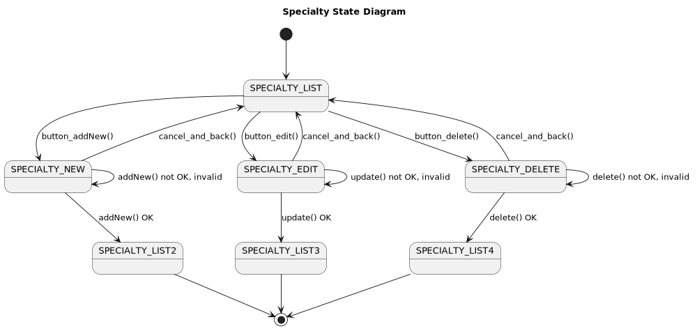
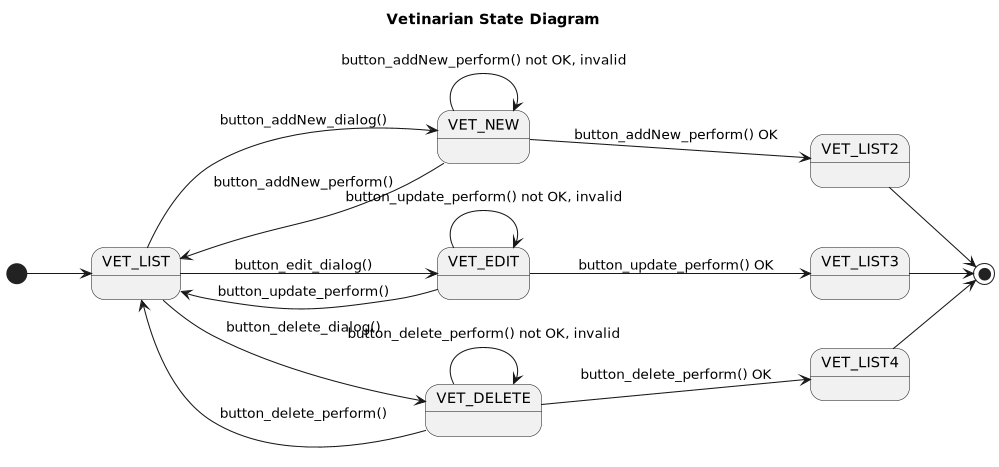
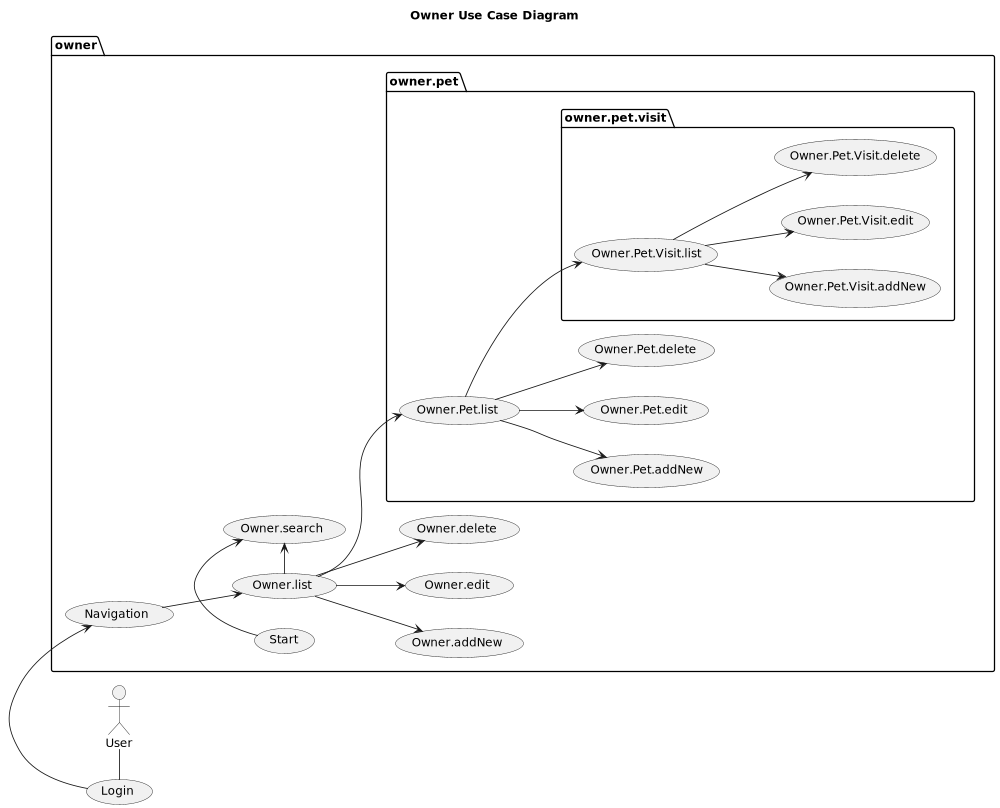
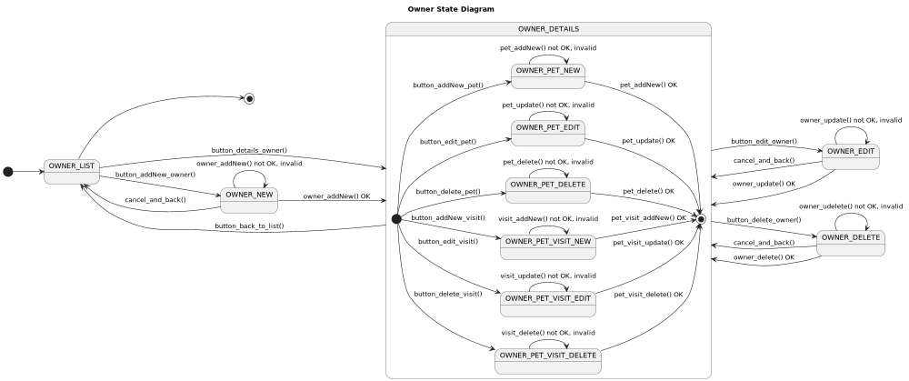
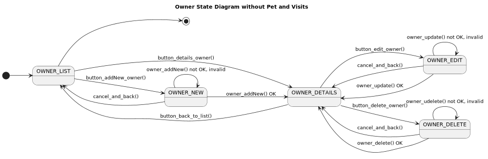

# petclinic-uml

Object Oriented Software Engineering: OOA and OOD of the Spring Petclinc using UML. 

## What is it?

These Demo Application are planned to be a "Rosetta Stone" for compare OOP Web Application Frameworks like 

* [Jakarta EE (Java)](https://jakarta-ee-petclinic.github.io/petclinic-jakartaee/)
* [Java EE 7](https://jakarta-ee-petclinic.github.io/petclinic-javaee7/)
* [Java EE 6](https://jakarta-ee-petclinic.github.io/petclinic-jee6/)
* [Symfony (PHP)](https://jakarta-ee-petclinic.github.io/petclinic_symfony/)
* [Django (Python)](https://jakarta-ee-petclinic.github.io/petclinic_django/)
* [Flask with SQLalchemy (Python)](https://jakarta-ee-petclinic.github.io/petclinic_flask/)
* Fluid,Extbase (TYPO3-CMS, PHP)

This OOA and OOD should extract and divide the functional Requirements from the nonfunctional Requirements 
of the Frameworks.

* Most of the Frameworks compared here use Model-2 MVC Pattern for the Web/Presentation-Tier 
but Jakarta EE uses JSF (Java Server Faces), a Component Based Web/Presentation-Tier. 

This Specification should also serve as Specification for non-Web Frontends like:
* [Qt (C++)]()
* [Qt (Python)]()
* [Java Swing]()

## Why Petclinic? 

* The Domain Classes show all relationships like one-to-many (1:n), many-to-one (n:1) and many-to-many (n:m)
* It is simple enough but yet it shows more than just the CRUD Use Cases (Create, Read, Update, Delete) of most Demos and Training Examples. 
* You can think of it as smallest complete Web App with the usual things to solve. 

## Functional Requirements 

Object Oriented Design

## Petclinic

### Petclinic Domain Class Modell

### Petclinic Use Case Diagram

## PetType 

### PetType Use Case Diagram

| PetType Use Cases |
|-------------------|
| PetType.list      |
| PetType.search    |
| PetType.addNew    |
| PetType.edit      |
| PetType.delete    | 

### PetType State Diagram

| PetType States                                             |
|------------------------------------------------------------|
| PETTYPE_LIST (PETTYPE_LIST2, PETTYPE_LIST3 ,PETTYPE_LIST4) |
| PETTYPE_NEW                                                |
| PETTYPE_EDIT                                               |
| PETTYPE_DELETE                                             |

| Actions  | Frontend to View | View to Backend (DB) |
|----------|------------------|----------------------|
| asdf()   | x                |                      |
| fdsfsd() |                  | x                    |

## Specialty

### Specialty Use Case Diagram

| Specialty Use Cases |
|---------------------|
| Specialty.list      |
| Specialty.search    |    
| Specialty.addNew    |
| Specialty.edit      |
| Specialty.delete    |

### Specialty State Diagram

| Specialty States                                                   | 
|--------------------------------------------------------------------|
| SPECIALTY_LIST (SPECIALTY_LIST2, SPECIALTY_LIST3, SPECIALTY_LIST4) |
| SPECIALTY_NEW                                                      |
| SPECIALTY_DELETE                                                   |    

| Actions  | Frontend to View | View to Backend (DB) |
|----------|------------------|----------------------|
| asdf()   | x                |                      |
| fdsfsd() |                  | x                    |

## Vetinarian

### Vetinarian Use Case Diagram

| Vetinarian Use Cases |
|----------------------|
| Vet.list             |
| Vet.search           |
| Vet.addNew           |
| Vet.edit             |
| Vet.delete           |

### Vetinarian State Diagram

| Vetinarian States                          |
|--------------------------------------------|
| VET_LIST (VET_LIST2 ,VET_LIST3 ,VET_LIST4) |
| VET_NEW                                    |
| VET_EDIT                                   |
| VET_DELETE                                 |

| Actions  | Frontend to View | View to Backend (DB) |
|----------|------------------|----------------------|
| asdf()   | x                |                      |
| fdsfsd() |                  | x                    |

## Owner

### Owner Use Cases

| Owner Use Cases        |
|------------------------|
| Owner.list             |
| Owner.search           |
| Owner.addNew           |
| Owner.edit             |
| Owner.delete           |
| Owner.Pet.list         |
| Owner.Pet.addNew       |
| Owner.Pet.edit         |
| Owner.Pet.delete       |
| Owner.Pet.Visit.list   |
| Owner.Pet.Visit.addNew |
| Owner.Pet.Visit.edit   |
| Owner.Pet.Visit.delete |

### Owner State Diagram

| Owner States           |
|------------------------|
| OWNER_LIST             |       
| OWNER_NEW              |      
| OWNER_DETAILS          |      
| OWNER_EDIT             |      
| OWNER_DELETE           |      
| OWNER_PET_NEW          |      
| OWNER_PET_EDIT         |      
| OWNER_PET_DELETE       |     
| OWNER_PET_VISIT_NEW    |   
| OWNER_PET_VISIT_EDIT   |  
| OWNER_PET_VISIT_DELETE |
| OWNER_PET_VISIT_NEW    | 
| OWNER_PET_VISIT_EDIT   | 
| OWNER_PET_VISIT_DELETE |

| Actions  | Frontend to View | View to Backend (DB) |
|----------|------------------|----------------------|
| asdf()   | x                |                      |
| fdsfsd() |                  | x                    |

### Owner State Diagram without Pet and Visits

### Owner State Diagram of Pet and Visits

## Imprint
* [(c) 2022 Thomas Woehlke](https://github.com/thomaswoehlke)
* [This Document](https://jakarta-ee-petclinic.github.io/petclinic-uml/)
* [github repository](https://github.com/Jakarta-EE-Petclinic/petclinic-uml)