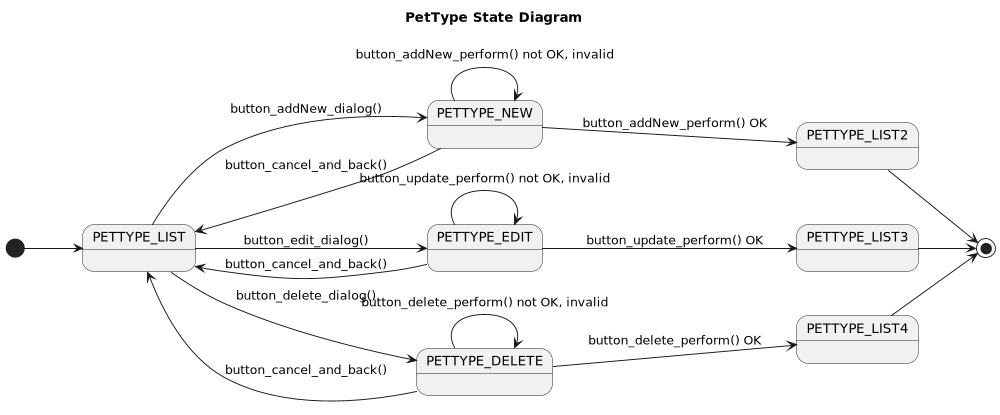
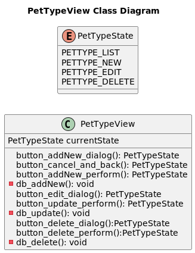
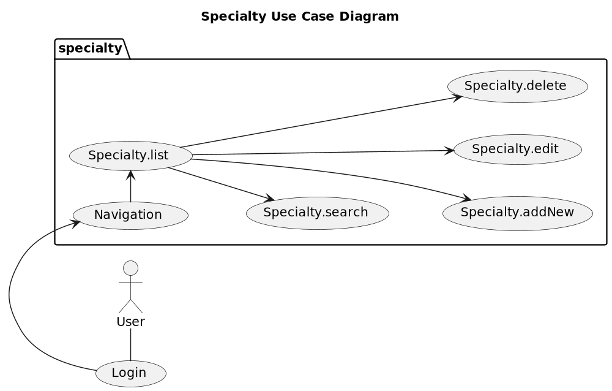
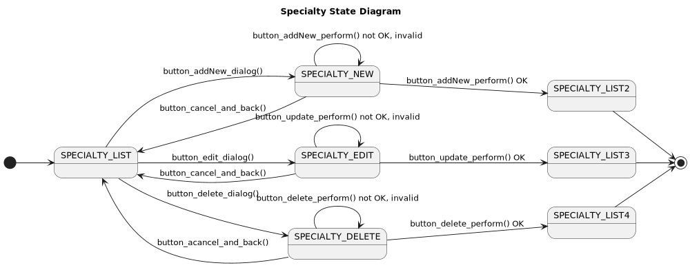
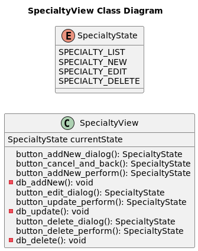
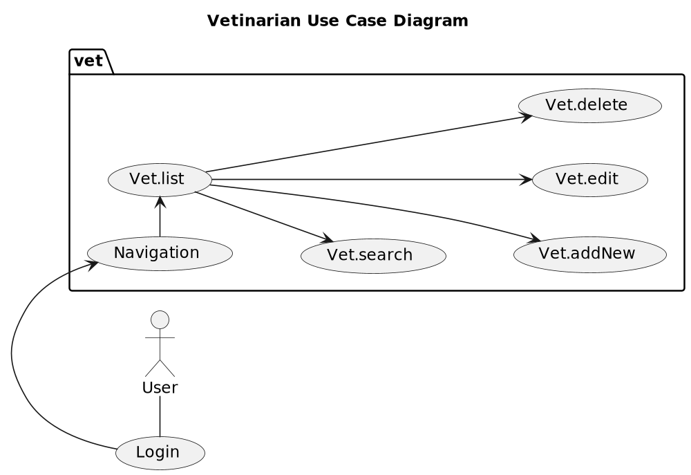
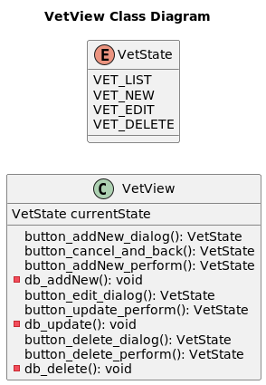
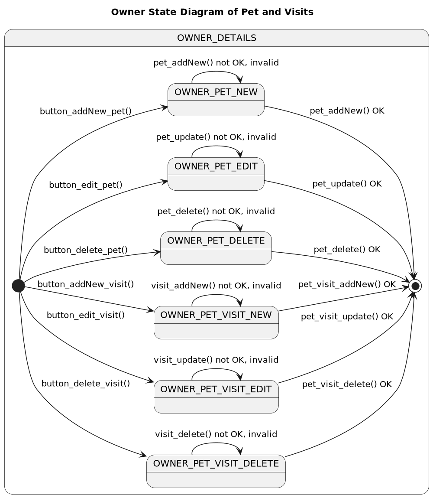

# petclinic-uml

Object Oriented Software Engineering: OOA and OOD of the Spring Petclinc using UML. 

## What is it?

These Demo Application are planned to be a "Rosetta Stone" for compare OOP Web Application Frameworks like 

* [Jakarta EE (Java)](https://jakarta-ee-petclinic.github.io/petclinic-jakartaee/)
* [Java EE 7](https://jakarta-ee-petclinic.github.io/petclinic-javaee7/)
* [Java EE 6](https://jakarta-ee-petclinic.github.io/petclinic-jee6/)
* [Symfony (PHP)](https://jakarta-ee-petclinic.github.io/petclinic_symfony/)
* [Django (Python)](https://jakarta-ee-petclinic.github.io/petclinic_django/)
* [Flask with SQLalchemy (Python)](https://jakarta-ee-petclinic.github.io/petclinic_flask/)
* Fluid,Extbase (TYPO3-CMS, PHP)

This OOA and OOD should extract and divide the functional Requirements from the nonfunctional Requirements 
of the Frameworks.

* Most of the Frameworks compared here use Model-2 MVC Pattern for the Web/Presentation-Tier 
but Jakarta EE uses JSF (Java Server Faces), a Component Based Web/Presentation-Tier. 

This Specification should also serve as Specification for non-Web Frontends like:
* [Qt (C++)](https://jakarta-ee-petclinic.github.io/petclinic-qt5/)
* [Qt (Python)](https://jakarta-ee-petclinic.github.io/petclinic-pyqt/)
* [Java Swing](https://jakarta-ee-petclinic.github.io/petclinic-java-swing/)

## Why Petclinic? 

* The Domain Classes show all relationships like one-to-many (1:n), many-to-one (n:1) and many-to-many (n:m)
* It is simple enough but yet it shows more than just the CRUD Use Cases (Create, Read, Update, Delete) of most Demos and Training Examples. 
* You can think of it as smallest complete Web App with the usual things to solve. 

## Functional Requirements 

Object Oriented Design

## Petclinic

### Petclinic Domain Class Modell

### Petclinic Use Case Diagram

## PetType 

### PetType Use Case Diagram

| PetType Use Cases |
|-------------------|
| PetType.list      |
| PetType.search    |
| PetType.addNew    |
| PetType.edit      |
| PetType.delete    | 

### PetType State Diagram

| PetType States |
|----------------|
| PETTYPE_LIST   |
| PETTYPE_NEW    |
| PETTYPE_EDIT   |
| PETTYPE_DELETE |
| PETTYPE_LIST2  |
| PETTYPE_LIST3  |
| PETTYPE_LIST4  |

| Actions                          | Frontend to View              | View to Backend (DB) | outcome             | precondition                   | postcondition                                |
|----------------------------------|-------------------------------|----------------------|---------------------|--------------------------------|----------------------------------------------|
| PetType.button_addNew_dialog()   | x                             |                      | change state        | PETTYPE_LIST                   | PETTYPE_NEW                                  |
| PetType.button_cancel_and_back() | x                             |                      | change state        | PETTYPE_NEW                    | PETTYPE_LIST                                 |
| PetType.button_addNew_perform()  | x, calls: PetType.db_addNew() |                      | if OK: change state | PETTYPE_NEW                    | PETTYPE_LIST                                 |
| PetType.db_addNew()              |                               | x                    | OK                  | length(list(PetType)) = n      | length(list(PetType)) = n+1                  |
| PetType.db_addNew()              |                               | x                    | not OK, invalid     | length(list(PetType)) = n      | display cause as flash message               |
| PetType.button_edit_dialog()     | x                             |                      | change state        | PETTYPE_LIST                   | PETTYPE_EDIT                                 |
| PetType.button_cancel_and_back() | x                             |                      | change state        | PETTYPE_EDIT                   | PETTYPE_LIST                                 |
| PetType.button_update_perform()  | x, calls: PetType.db_update() |                      | if OK: change state | PETTYPE_EDIT                   | PETTYPE_LIST                                 |
| PetType.db_update()              |                               | x                    | OK                  | length(list(PetType)) = n > 0  | length(list(PetType)) = n; 1 element changed |
| PetType.db_update()              |                               | x                    | not OK, invalid     | length(list(PetType)) = n >= 0 | display cause as flash message               |
| PetType.button_delete_dialog()   | x                             |                      | change state        | PETTYPE_LIST                   | PETTYPE_DELETE                               |
| PetType.button_cancel_and_back() | x                             |                      | change state        | PETTYPE_DELETE                 | PETTYPE_LIST                                 |
| PetType.button_delete_perform()  | x, calls: PetType.db_delete() |                      | if OK: change state | PETTYPE_DELETE                 | PETTYPE_LIST                                 |
| PetType.db_delete()              |                               | x                    | OK                  | length(list(PetType)) = n > 0  | length(list(PetType)) = n-1                  |
| PetType.db_delete()              |                               | x                    | not OK, invalid     | length(list(PetType)) = n >= 0 | display cause as flash message               |

## Specialty

### Specialty Use Case Diagram

| Specialty Use Cases |
|---------------------|
| Specialty.list      |
| Specialty.search    |    
| Specialty.addNew    |
| Specialty.edit      |
| Specialty.delete    |

### Specialty State Diagram

| Specialty States | 
|------------------|
| SPECIALTY_LIST   |
| SPECIALTY_NEW    |
| SPECIALTY_EDIT   |  
| SPECIALTY_DELETE |    
| SPECIALTY_LIST2  |
| SPECIALTY_LIST3  |
| SPECIALTY_LIST4  |

| Actions                            | Frontend to View                | View to Backend (DB) | outcome             | precondition                     | postcondition                                  |
|------------------------------------|---------------------------------|----------------------|---------------------|----------------------------------|------------------------------------------------|
| Specialty.button_addNew_dialog()   | x                               |                      | change state        | SPECIALTY_LIST                   | SPECIALTY_NEW                                  |
| Specialty.button_cancel_and_back() | x                               |                      | change state        | SPECIALTY_NEW                    | SPECIALTY_LIST                                 |
| Specialty.button_addNew_perform()  | x, calls: Specialty.db_addNew() |                      | if OK: change state | SPECIALTY_NEW                    | SPECIALTY_LIST                                 |
| Specialty.db_addNew()              |                                 | x                    | OK                  | length(list(Specialty)) = n      | length(list(Specialty)) = n+1                  |
| Specialty.db_addNew()              |                                 | x                    | not OK, invalid     | length(list(Specialty)) = n      | display cause as flash message                 |
| Specialty.button_edit_dialog()     | x                               |                      | change state        | SPECIALTY_LIST                   | SPECIALTY_EDIT                                 |
| Specialty.button_cancel_and_back() | x                               |                      | change state        | SPECIALTY_EDIT                   | SPECIALTY_LIST                                 |
| Specialty.button_update_perform()  | x, calls: Specialty.db_update() |                      | if OK: change state | SPECIALTY_EDIT                   | SPECIALTY_LIST                                 |
| Specialty.db_update()              |                                 | x                    | OK                  | length(list(Specialty)) = n > 0  | length(list(Specialty)) = n; 1 element changed |
| Specialty.db_update()              |                                 | x                    | not OK, invalid     | length(list(Specialty)) = n >= 0 | display cause as flash message                 |
| Specialty.button_delete_dialog()   | x                               |                      | change state        | SPECIALTY_LIST                   | SPECIALTY_DELETE                               |
| Specialty.button_cancel_and_back() | x                               |                      | change state        | SPECIALTY_DELETE                 | SPECIALTY_LIST                                 |
| Specialty.button_delete_perform()  | x, calls: Specialty.db_delete() |                      | if OK: change state | SPECIALTY_DELETE                 | SPECIALTY_LIST                                 |
| Specialty.db_delete()              |                                 | x                    | OK                  | length(list(Specialty)) = n > 0  | length(list(Specialty)) = n-1                  |
| Specialty.db_delete()              |                                 | x                    | not OK, invalid     | length(list(Specialty)) = n >= 0 | display cause as flash message                 |

## Vetinarian

### Vetinarian Use Case Diagram

| Vetinarian Use Cases |
|----------------------|
| Vet.list             |
| Vet.search           |
| Vet.addNew           |
| Vet.edit             |
| Vet.delete           |

### Vetinarian State Diagram

| Vetinarian States |
|-------------------|
| VET_LIST          |
| VET_NEW           |
| VET_EDIT          |
| VET_DELETE        |      
| VET_LIST2         |
| VET_LIST3         |  
| VET_LIST4         |  

| Actions                             | Frontend to View                 | View to Backend (DB) | outcome             | precondition                      | postcondition                                   |
|-------------------------------------|----------------------------------|----------------------|---------------------|-----------------------------------|-------------------------------------------------|
| Vetinarian.button_addNew_dialog()   | x                                |                      | change state        | VET_LIST                          | VET_NEW                                         |
| Vetinarian.button_cancel_and_back() | x                                |                      | change state        | VET_NEW                           | VET_LIST                                        |
| Vetinarian.button_addNew_perform()  | x, calls: Vetinarian.db_addNew() |                      | if OK: change state | VET_NEW                           | VET_LIST                                        |
| Vetinarian.db_addNew()              |                                  | x                    | OK                  | length(list(Vetinarian)) = n      | length(list(Vetinarian)) = n+1                  |
| Vetinarian.db_addNew()              |                                  | x                    | not OK, invalid     | length(list(Vetinarian)) = n      | display cause as flash message                  |
| Vetinarian.button_edit_dialog()     | x                                |                      | change state        | VET_LIST                          | VET_EDIT                                        |
| Vetinarian.button_cancel_and_back() | x                                |                      | change state        | VET_EDIT                          | VET_LIST                                        |
| Vetinarian.button_update_perform()  | x, calls: Vetinarian.db_update() |                      | if OK: change state | VET_EDIT                          | VET_LIST                                        |
| Vetinarian.db_update()              |                                  | x                    | OK                  | length(list(Vetinarian)) = n > 0  | length(list(Vetinarian)) = n; 1 element changed |
| Vetinarian.db_update()              |                                  | x                    | not OK, invalid     | length(list(Vetinarian)) = n >= 0 | display cause as flash message                  |
| Vetinarian.button_delete_dialog()   | x                                |                      | change state        | VET_LIST                          | VET_DELETE                                      |
| Vetinarian.button_cancel_and_back() | x                                |                      | change state        | VET_DELETE                        | VET_LIST                                        |
| Vetinarian.button_delete_perform()  | x, calls: Vetinarian.db_delete() |                      | if OK: change state | VET_DELETE                        | VET_LIST                                        |
| Vetinarian.db_delete()              |                                  | x                    | OK                  | length(list(Vetinarian)) = n > 0  | length(list(Vetinarian)) = n-1                  |
| Vetinarian.db_delete()              |                                  | x                    | not OK, invalid     | length(list(Vetinarian)) = n >= 0 | display cause as flash message                  |

## Owner

### Owner Use Cases

| Owner Use Cases        |
|------------------------|
| Owner.list             |
| Owner.search           |
| Owner.addNew           |
| Owner.edit             |
| Owner.delete           |
| Owner.Pet.list         |
| Owner.Pet.addNew       |
| Owner.Pet.edit         |
| Owner.Pet.delete       |
| Owner.Pet.Visit.list   |
| Owner.Pet.Visit.addNew |
| Owner.Pet.Visit.edit   |
| Owner.Pet.Visit.delete |

### Owner State Diagram

#### Owner State Diagram without Pet and Visits

#### Owner State Diagram of Pet and Visits

| Owner States           |
|------------------------|
| OWNER_LIST             |       
| OWNER_NEW              |      
| OWNER_DETAILS          |      
| OWNER_EDIT             |      
| OWNER_DELETE           |      
| OWNER_PET_NEW          |      
| OWNER_PET_EDIT         |      
| OWNER_PET_DELETE       |     
| OWNER_PET_VISIT_NEW    |   
| OWNER_PET_VISIT_EDIT   |  
| OWNER_PET_VISIT_DELETE |
| OWNER_PET_VISIT_NEW    | 
| OWNER_PET_VISIT_EDIT   | 
| OWNER_PET_VISIT_DELETE |

| Actions                              | Frontend to View                  | View to Backend (DB) | outcome             | precondition                  | postcondition                              |
|--------------------------------------|-----------------------------------|----------------------|---------------------|-------------------------------|--------------------------------------------|
| Owner.button_owner_addNew_dialog()   | x                                 |                      | change state        | OWNER_LIST                    | OWNER_NEW                                  |
| Owner.button_owner_cancel_and_back() | x                                 |                      | change state        | OWNER_NEW                     | OWNER_LIST                                 |
| Owner.button_owner_addNew_perform()  | x, calls: Owner.db_owner_addNew() |                      | if OK: change state | OWNER_NEW                     | OWNER_LIST                                 |
| Owner.db_owner_addNew()              |                                   | x                    | OK                  | length(list(Owner)) = n       | length(list(Owner)) = n+1                  |
| Owner.db_owner_addNew()              |                                   | x                    | not OK, invalid     | length(list(Owner)) = n       | display cause as flash message             |
| Owner.button_owner_details_dialog()  | x                                 |                      | change state        | OWNER_LIST                    | OWNER_DETAILS                              |
| Owner.button_owner_back_to_list()    | x                                 |                      | change state        | OWNER_DETAILS                 | OWNER_LIST                                 |
| Owner.button_owner_edit_dialog()     | x                                 |                      | change state        | OWNER_DETAILS                 | OWNER_EDIT                                 |
| Owner.button_owner_cancel_and_back() | x                                 |                      | change state        | OWNER_EDIT                    | OWNER_DETAILS                              |
| Owner.button_owner_update_perform()  | x, calls: Owner.db_owner_update() |                      | if OK: change state | OWNER_EDIT                    | OWNER_DETAILS                              |
| Owner.db_owner_update()              |                                   | x                    | OK                  | length(list(Owner)) = n > 0   | length(list(Owner)) = n; 1 element changed |
| Owner.db_owner_update()              |                                   | x                    | not OK, invalid     | length(list(Owner)) = n >= 0  | display cause as flash message             |
| Owner.button_owner_delete_dialog()   | x                                 |                      | change state        | OWNER_DETAILS                 | OWNER_DELETE                               |
| Owner.button_owner_cancel_and_back() | x                                 |                      | change state        | OWNER_DELETE                  | OWNER_DETAILS                              |
| Owner.button_owner_delete_perform()  | x, calls: Owner.db_owner_delete() |                      | if OK: change state | OWNER_DELETE                  | OWNER_DETAILS                              |
| Owner.db_owner_delete()              |                                   | x                    | OK                  | length(list(Owner)) = n > 0   | length(list(Owner)) = n-1                  |
| Owner.db_owner_delete()              |                                   | x                    | not OK, invalid     | length(list(Owner)) = n >= 0  | display cause as flash message             |
| Owner.button_pet_addNew_dialog()     | x                                 |                      | change state        | OWNER_DETAILS                 | OWNER_PET_NEW                              |
| Owner.button_pet_edit_dialog()       | x                                 |                      | change state        | OWNER_DETAILS                 | OWNER_PET_EDIT                             |
| Owner.button_pet_delete_dialog()     |                                   |                      | change state        | OWNER_DETAILS                 | OWNER_PET_DELETE                           |
| Owner.button_visit_addNew_dialog()   | x                                 |                      | change state        | OWNER_DETAILS                 | OWNER_PET_VISIT_NEW                        |
| Owner.button_visit_edit_dialog()     |                                   |                      | change state        | OWNER_DETAILS                 | OWNER_PET_VISIT_EDIT                       |
| Owner.button_visit_delete_dialog()   |                                   |                      | change state        | OWNER_DETAILS                 | OWNER_PET_VISIT_DELETE                     |
| Owner.button_pet_addNew_perform()    | x, calls: Owner.db_pet_addNew()   |                      | change state        | OWNER_PET_NEW                 | OWNER_DETAILS                              |
| Owner.db_pet_addNew()                |                                   | x                    | OK                  | length(list(Pet)) = n         | length(list(Pet)) = n+1                    |
| Owner.db_pet_addNew()                |                                   | x                    | not OK, invalid     | length(list(Pet)) = n         | display cause as flash message             |
| Owner.button_pet_update_perform()    | x, calls: Owner.db_pet_update()   |                      | change state        | OWNER_PET_EDIT                | OWNER_DETAILS                              |
| Owner.db_pet_update()                |                                   | x                    | OK                  | length(list(Pet)) = n         | length(list(Pet)) = n; 1 element changed   |
| Owner.db_pet_update()                |                                   | x                    | not OK, invalid     | length(list(Pet)) = n         | display cause as flash message             |
| Owner.button_pet_delete_perform()    | x, calls: Owner.db_pet_delete()   |                      | change state        | OWNER_PET_DELETE              | OWNER_DETAILS                              |
| Owner.db_pet_delete()                |                                   | x                    | OK                  | length(list(Pet)) = n > 0     | length(list(Pet)) = n-1                    |
| Owner.db_pet_delete()                |                                   | x                    | not OK, invalid     | length(list(Pet)) = n >= 0    | display cause as flash message             |
| Owner.button_visit_addNew_perform()  | x, calls: Owner.db_visit_addNew() |                      | change state        | OWNER_PET_VISIT_NEW           | OWNER_DETAILS                              |
| Owner.db_visit_addNew()              |                                   | x                    | OK                  | length(list(Visit)) = n       | length(list(Visit)) = n+1                  |
| Owner.db_visit_addNew()              |                                   | x                    | not OK, invalid     | length(list(Visit)) = n       | display cause as flash message             |
| Owner.button_visit_update_perform()  | x, calls: Owner.db_visit_update() |                      | change state        | OWNER_PET_VISIT_EDIT          | OWNER_DETAILS                              |
| Owner.db_visit_update()              |                                   | x                    | OK                  | length(list(Visit)) = n       | length(list(Visit)) = n; 1 element changed |
| Owner.db_visit_update()              |                                   | x                    | not OK, invalid     | length(list(Visit)) = n       | display cause as flash message             |
| Owner.button_visit_delete_perform()  | x, calls: Owner.db_visit_delete() |                      | change state        | OWNER_PET_VISIT_DELETE        | OWNER_DETAILS                              |
| Owner.db_visit_delete()              |                                   | x                    | OK                  | length(list(Visit)) = n > 0   | length(list(Visit)) = n-1                  |
| Owner.db_visit_delete()              |                                   | x                    | not OK, invalid     | length(list(Visit)) = n >= 0  | display cause as flash message             |

## Imprint
* [(c) 2022 Thomas Woehlke](https://github.com/thomaswoehlke)
* [This Document](https://jakarta-ee-petclinic.github.io/petclinic-uml/)
* [github repository](https://github.com/Jakarta-EE-Petclinic/petclinic-uml)